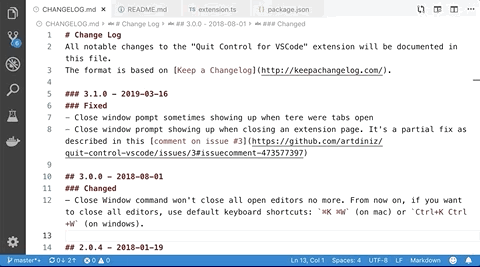
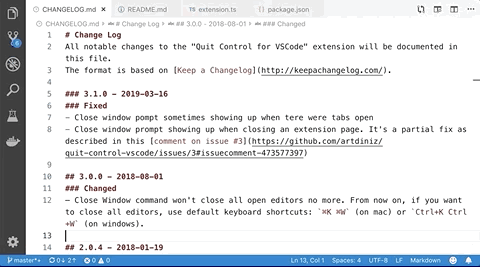
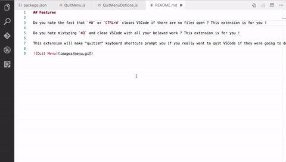
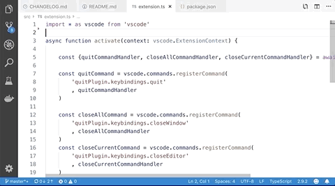

# Quit Control

Do you hate mistyping `⌘Q` and shutdown VSCode with all your unsaved and beloved work? This extension is for you!

Do you hate the fact that `⌘W` or `CTRL+W` closes VSCode if there are no open files? This extension is for you!

This extension will make all "quitish" keyboard shortcuts prompt you if you really want to close everything if they were going to do so.

## Features

1. If at any moment you hit `⌘Q` (on mac) or `Ctrl+Q` (on other platforms) we will prompt you if you really want to quit:
    
    * You can press `Esc` to dismiss and continue your work:
        
        

    * You can press `Enter` to confirm and quit VSCode:
        
        

2. If there is an open file, `⌘W` (on mac) or `Ctrl+W` (on other platforms) will close it as usual. But if there is no open file, instead of closing VSCode window we will prompt you first:

    

3. If you hit `⇧⌘W` (on mac) or `⇧+Ctrl+W` (on other platforms), instead of closing VSCode window, we will prompt you first:

    

## Release Notes vUNRELEASED - yyyy-mm-dd
### Added
- Linux and Windows: Preventing `Alt+F4` from closing the window;
- Linux and Windows: Optionally enabling `Ctrl+F4` to close empty window (window without open tabs);
- Linux and Windows: New configuration `quitControl.macLikeMode`, defaults to `true`. It enables macOS-like behaviors: 
    - `Ctrl+Q` to quit VSCode;
    - `Ctrl+W` and `Ctrl+F4` to close empty window (window without open tabs);

## Source

[GitHub](https://github.com/artdiniz/quitControlVSCode)

## License

[MIT](https://raw.githubusercontent.com/artdiniz/quitControlVSCode/master/LICENSE)

## Credits

This [extension's icon](https://github.com/artdiniz/quitControlVSCode/blob/master/images/icon.png) was created by Hrag Chanchanian from the Noun Project and its colors where changed by me for use in this extension.