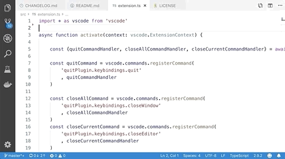

# Quit Control

Do you hate the fact that `⌘W` or `CTRL+W` closes VSCode if there are no open files? This extension is for you!

Do you hate mistyping `⌘Q` and shutdown VSCode with all your unsaved and beloved work? This extension is for you!

This extension will make all "quitish" keyboard shortcuts prompt you if you really want to close everything if they were going to do so.

## Features

1. If there is an open file, `⌘W` (on mac) or `Ctrl+W` (on other platforms) will close it as usual. But if there is no open file, instead of closing VSCode window we will prompt you first:

    

2. If you hit `⇧⌘W` (on mac) or `⇧+Ctrl+W` (on other platforms) all your files will be closed as usual. But instead of closing VSCode window, we will prompt you first:

    

3. If you hit `⌘Q` at any moment we will prompt you if you really want to quit:

    

## Source

[GitHub](https://github.com/artdiniz/quitControlVSCode)

## License

[MIT](https://raw.githubusercontent.com/artdiniz/quitControlVSCode/master/LICENSE)

## Credits

This [extension's icon](https://github.com/artdiniz/quitControlVSCode/blob/master/images/icon.png) was created by Hrag Chanchanian from the Noun Project and its colors where changed by me for use in this extension.